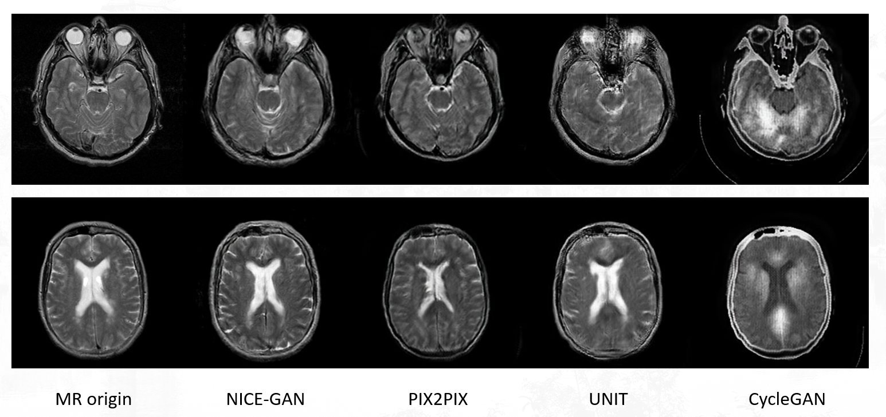
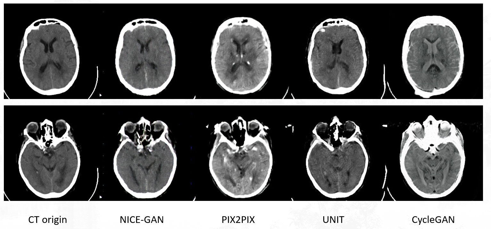
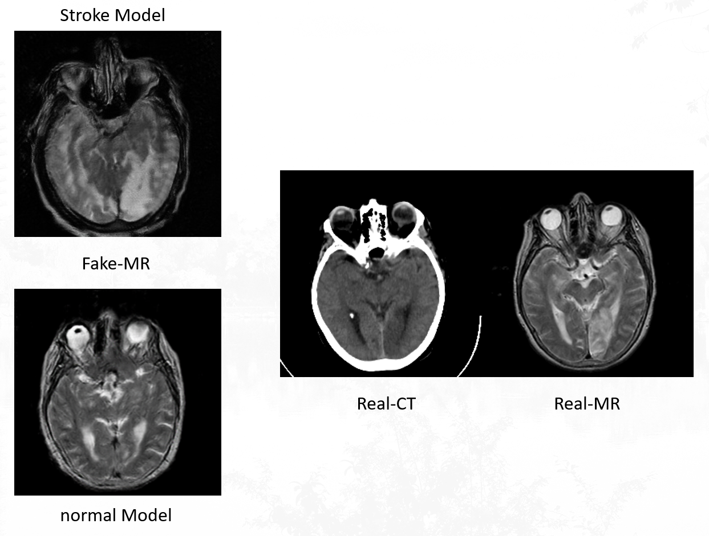

# About CT2MR project
This project compares the performance of several Image Translation on ordinary CT-MR paired-data, and shows the NICE-GAN's generation performance on the Stroke (unpaired) dataset.
## Introduction
This project compared the performance of Cycle-GAN, PIX2PIX, UNIT (UNsupervised Image-to-image Translation) and NICE-GAN (No-Independent-Component-for-Encoding GAN) on CT to MR image translation task. We made the comparison both on the generative image and usual benchmarks of GAN, which concluded that NICE-GAN has the best performance.

What's more, we use the Stroke dataset (unpaired) to train NICE-GAN  and test it on the paired-unlabelled dataset. Then we compared the test performance of the models trained on Stroke dataset and paired dataset on the test set of paired dataset. For the MR image generation, the Stroke model is not good as paired model , but it can be more clear to restore the inapparent nidus in CT image as the training goes on.

Finally, we used the imaging features of Stroke's disease and made some modifications based on NICE-GAN to make it more suitable for generating specific regional features. We introduced a new type of loss: Pair Loss, that represnts the distance between the CT image and the MR image of the same patient and the same slice. For converting the CT image to the MR image with specific regional features,  we utilize Mask-weighted loss to emphasize the nidus. Mask can be obtained from the segmentation model on the entire classification dataset. This part of the progress has not been carried out due to the necessary authority from hospital and the privacy of data. We only implemented a general framework here.
## Result
### CT to MR translation via four methods
<div align="center">
  
</div>

### MR to CT translation via four methods
<div align="center">
  
</div>

### Comparison between stroke-trained NICE-GAN and paired-trained NICE-GAN for restoring nidus
<div align="center">
  
</div>

### Author
Sheng Hu & Weijie Chen

## Code structure
* main.py :  The standard workflow to build/train/test a model
* options.py : The hyperparameters of model and the setting about train/test process
* **util** : Some code about data visualization and  processing  for specific models
* **evaluation** : Some code about model evalution and data cleaning
* **data** : Some code about data loading and preprocess
* **models** : A folder where contains different models and network structure，include cycle-gan, pix2pix, nice-gan, unit and a nice-gan variant (mnice-gan).

### Contribution statement
Most of code in **util** and **data** credits to the projects in Acknowledgments.

In the folder **model**, we modified some code of 4 existed models to adapt the standard workflow. Besides, we made some improvement based on nice-gan and named it mnice-gan.


### Prerequisites
* Python 3.6.9
* Pytorch 1.1.0 and torchvision (https://pytorch.org/)
* TensorboardX
* Tensorflow (for tensorboard usage)
* CUDA 10.0.130, CuDNN 7.3, and Ubuntu 16.04.

## Usage
### Data prepare
You should arrange your dataset as the following folder structure
```
├── dataset
   └── YOUR_DATASET_NAME
       ├── trainA
           ├── xxx.jpg (name, format doesn't matter)
           ├── yyy.png
           └── ...
       ├── trainB
           ├── zzz.jpg
           ├── www.png
           └── ...
       ├── testA
           ├── aaa.jpg
           ├── bbb.png
           └── ...
       ├── testB
           ├── ccc.jpg
           ├── ddd.png
           └── ...
       └── label (only for nice-gan variant)
           ├── eee.jpg
           ├── fff.png
           └── ...
```

### Train
```
> python main.py --dataroot ./dataset/ct2mr --name gan1 --model nice_gan
```
* (For nice-gan and its variant) If the memory of gpu is **not sufficient**, set `--light`

### Test
```
> python main.py --dataroot ./dataset/ct2mr --phase test --name gan1 --model nice_gan
```
### Setting options
You can use the following command to know details of all setting options
```
> python main.py -h
```

## Acknowledgments
Our project contains the following model:
* cycle-gan and pix2pix (https://github.com/junyanz/pytorch-CycleGAN-and-pix2pix)
* nice-gan (https://github.com/alpc91/NICE-GAN-pytorch)
* UNIT (https://github.com/mingyuliutw/UNIT)
